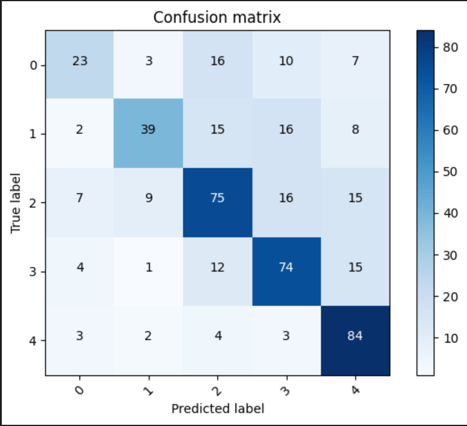
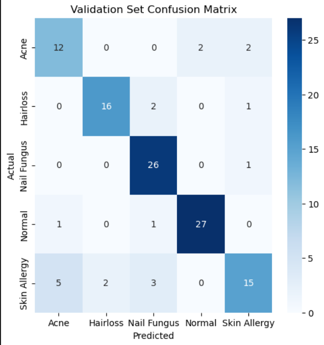

# Skin Disease Classification

This repository contains a project for classifying skin diseases using two different approaches:
1. **Support Vector Machine (SVM)** - A machine learning algorithm implemented in `diseases_prediction.ipynb`.
2. **Convolutional Neural Network (CNN)** - A deep learning approach implemented in `deep_learning.ipynb`.

## Project Overview
Skin disease classification is crucial for early diagnosis and treatment. In this project, we explore two methodologies:
- **SVM**: A classical machine learning approach that works well for structured data.
- **CNN**: A deep learning model that leverages image features for classification.


## 📂 skin-disease-classification
- deep_learning.ipynb          (CNN implementation for skin disease classification)
-  diseases_prediction.ipynb    (SVM implementation for skin disease classification)
                 


## Requirements
To run the notebooks, install the required dependencies:
```bash
pip install numpy pandas scikit-learn tensorflow keras matplotlib
```

## How to Use
1. Clone this repository:
```bash
git clone https://github.com/your-username/skin-disease-classification.git
cd skin-disease-classification
```
2. Open the Jupyter notebooks:
```bash
jupyter notebook
```
3. Run the corresponding notebook based on the algorithm you want to use:
   - `diseases_prediction.ipynb` for SVM
   - `deep_learning.ipynb` for CNN

## Dataset
The dataset used in this project consists of images labeled into five classes:
- Acne
- Hairloss
- Nail Fungus
- Normal
- Skin Allergy

You can access the dataset from Kaggle: [Various Skin Diseases Dataset](https://www.kaggle.com/datasets/akshitmadan/various-skin-diseases-dataset)

## Results
- **SVM Model**:
  accuracy - 63%
- **Confusion Matrix**:
  
  
  
- **CNN Model**:
  validation accuracy: 82.76%
  
  validation loss: 0.6116
- **Confusion Matrix**:
  
  
   

## Future Work
- Use better data and increase classes
- Deploy the model as a web application and mobile app for real-time diagnosis.


